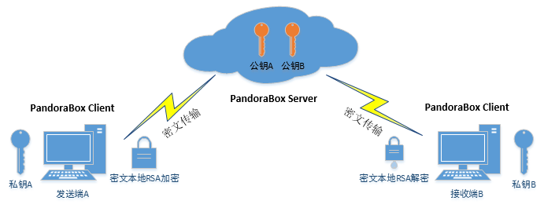
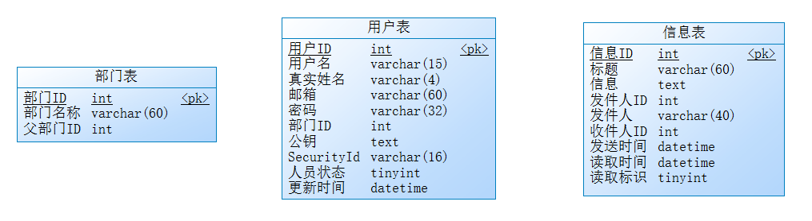
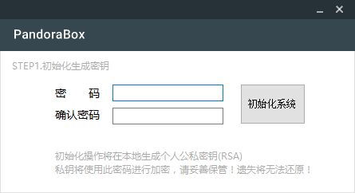
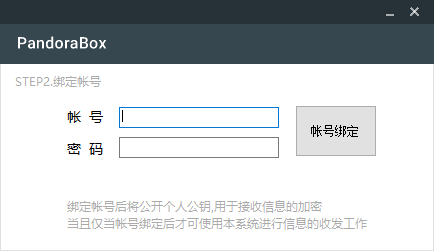
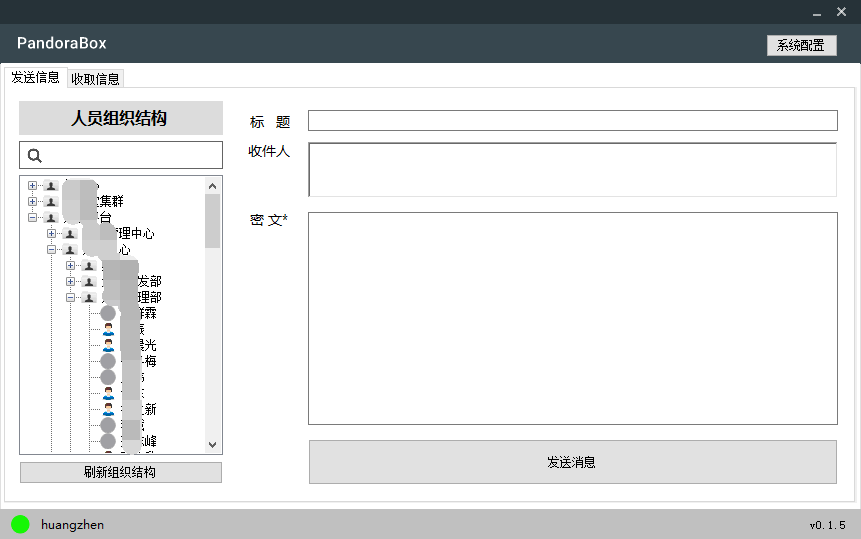

    
    <h3 align="center">PandoraBox | 私密信息传递工具</h3>
    

         基于非对称加密(RSA)的私密信息传递工具，数据由本地客户端进行加密、解密操作，密文通过网络进行传输，确保信息的安全性！
          
         <a href="https://github.com/gy-games/pandorabox"><strong>-- Browse Website --</strong></a>
          
          
         
         
    
    

# 系统介绍 #
PandoraBox 由Server与Client两部分组成，Server使用Java SpringBoot编写，数据存储为Mysql，欢迎页面使用iview编写；Client使用C#编写，数据存储为sqlite，Client使用inno setup打包为安装包。且为了方便快速的信息发送，Server的数据结构内需要维护一套用户验证体系与用户组织结构，目前PandoraBox仅可发送文本信息。

# 设计思路 #

- PandoraBox Client本地初始化时生成RSA公钥、私钥，公钥上传至PandoraBox Server，私钥通过设置的本地密码进行DES加密
- 用户发送私密信息时，PandoraBox Client向PandoraBox Server请求获取接收者公钥，并将信息使用此公钥进行加密后发送至网络
- 用户接收私密信息时，PandoraBox Client向PandoraBox Server请求获取密文，通过本地密码解密自己的RSA私钥，并通过此私钥进行密文的解密工作

# 如何构建并部署PandoraBox #

## PandoraBox Client

### STEP 1 ： 更新PandoraBox Client程序的Server端地址 ##

打开Client工程，更新Client程序的App.config中 <add key="host" value="http://pandorabox.gyyx.cn"></add> 中的“pandora.gyyx.cn”为自己部署的Server地址，重新构建Client程序,Client端编译时注意选择Release，使用InnoSetup打包时将读取Release的文件列表

### STEP 2 ：  使用./Client/Setup/build_setup.iss 重新打包安装包

InnoSetup打包为安装包时，安装包将放入.\server\src\main\resources\static\software内，供Web下载，使用InnoSetup打包完成后再进行Server端的打包工作，为访问WEB主页时可进行客户端的下载

## PandoraBox Server

### STEP 1 ： 初始化数据库并初始化人员组织结构 ###

且为了方便快速的信息发送，Server的数据结构内需要维护一套用户验证体系与用户组织结构，组织结构可以通过两种方式初始化，1、直接填充数据库，2、实现Pandora Server端的预留接口

#### 方法1：直接填充数据库 ####

Pandora的数据库结构非常简单，只有三张表,用户可以直接将数据导入部门表与用户表即可。用户表密码使用MD5加密（也可留空）

#### 方法2：实现PandoraBox Server端的预留方法 ####

在 **cn.gyyx.pandora.thirdparty** 下预留了几个方法：
- Boolean thridAuth(String username,String passwd) 第三方接口用户认证 ：可以在此实现基于自身OA或认证系统的认证，当用户表内密码留空时，将调用此方法进行权限认证
- void saveUserList() 保存员工列表 ： 可在此实现写入用户表的方法
- void saveDeptList(String pdid) 保存部门列表：可在此实现写入组织结构列表的方法
- void updateOffwork() 更新员工状态 ：可在此实现更新用户状态方法

目前定时器设置的每天2点执行一次，可根据情况修改run方法注解

### STEP 2 ：打包部署

注意打包前一定要先编译Client否则访问主页将无法下载Client安装包（编译完后地址为.\server\src\main\resources\static\software\PandoraBox.exe），将打完的Jar包 java -jar 启动即可

# 如何使用PandoraBox收发信息 #

## STEP 1 ： 初始化生成密钥 ##

## STEP 2 ： 绑定帐号 ##

## STEP 3 ： 收发信息 ##

# 其他事项 #

- 私密信息发送后，用户仅可收取一次，收取后会将密文存入本地，每次点击时解密
- 若需要重定义web主页的内容，可以编辑.\server\fe工程后 npm run build （注意删掉.\server\src\main\resources\static以前的内容）